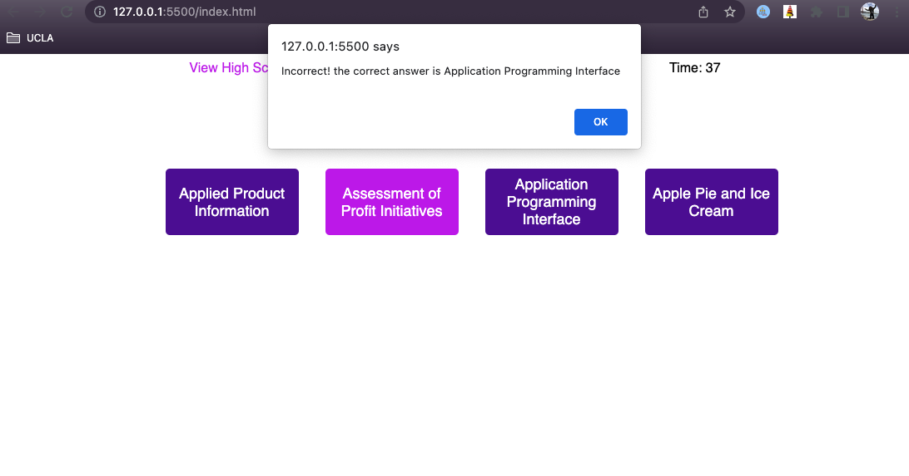
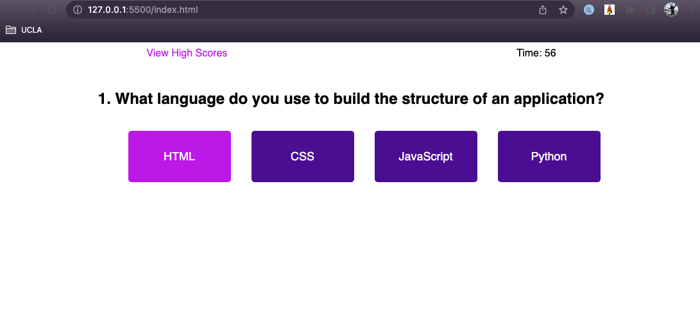

# Challenge Four - Coding Quiz

## Description
This week's assignment was to build a timed coding quiz from scratch. While it was mostly JavaScript, there is a small amount of HTML, and you create your own design using CSS.

There were many tasks this application needed to do, and it was a major step up compared to last week's password generator. Everything truly had to be broken down into each individual action. This is something I am still struggling to do, so this assignment was a huge challenge for me.

One of the last things I did was the task of getting the computer to tell the user if they answered correctly or not. After stressing about it, thinking where in the code would I add it, I realized I could do an alert! This saved me a lot of time and energy. The prompt and alert features are extremely useful, and I'm glad I learned them.

I was really happy to get to use some advanced CSS again. I added a :hover pseudo class so that the user could easily tell which answer they were selecting.

This project used many aspects of what we learned in class last week, such as DOM traversal, local storage, and timers. It was super beneficial to get to use those in practice. While I needed help and guidance every single step of the way on this one, I feel I learned a lot of valuable information as I went. 

## Link
You can check out my application at https://carlihudson.github.io/js-coding-quiz

## Usage
This application is used to test users' knowledge of basic coding trivia, and stores their scores

## Credits
I had a ton of help this week. I worked with my instructor, Jonathan Harvey, my tutor, Corrado Alfano, and many, many AskBCS Learning Assistants. Additionally, I studied with fellow classmates Ken Gibson, Matt Tobin, and Tua Tuivai.